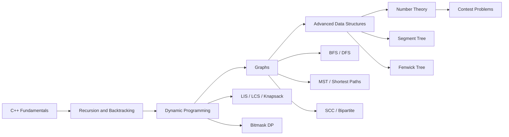

# Competetive Programming


This repository is a C++ competitive-programming practice archive. It contains Coding Ninjas course work, interview-style problems, and topic-wise algorithm implementations across dynamic programming, graph algorithms, number theory, segment trees, Fenwick trees, recursion, backtracking, OOP, and game theory.

The repository name keeps the original spelling, `Competetive_programming`, but the content is a broad competitive programming collection.

## Repository Snapshot

- 241 C++ source files
- 216 files with a `main()` function
- 29 topic folders under `coding_ninja/`
- Core language: C++
- Main style: standalone online-judge submissions and course exercise files
- Also includes a few compiled artifacts (`.out`, `.exe`) and course notes

## Learning Map



## Repository Structure

```text
.
`-- coding_ninja/
    |-- 8. opps1/
    |-- 9.opps2/
    |-- 25.oops3/
    |-- 25.oops3-2/
    |-- advance_recursion/
    |-- backtracking/
    |-- Assignment-Backtracking,Binary Search_And_Merge_Sort_Problems/
    |-- sorting_applications/
    |-- adhoc_problem/
    |-- DP/
    |-- DP-2/
    |-- Dp&Bitmasking/
    |-- dp&_bit_masking/
    |-- Graphs/
    |-- Graph2/
    |-- advance_graphs/
    |-- BST/
    |-- Segment_tree/
    |-- fenwick_trees/
    |-- Bit_Manipulation/
    |-- number_theory_1/
    |-- number_theory_2/
    |-- number_theory_3/
    |-- application_of_number_theory_1/
    |-- Game_theory/
    |-- greedy/
    |-- Codezen/
    |-- Computation_Geometry/
    `-- FFT/
```

## Topic Guide

| Folder | Approx. C++ Files | Focus |
| --- | ---: | --- |
| `8. opps1/` | 12 | C++ classes, constructors, objects, fractions, complex numbers |
| `9.opps2/` | 14 | Dynamic arrays, deep copy, static members, operator behavior |
| `25.oops3/` | 13 | Inheritance, polymorphism, virtual functions, multiple inheritance |
| `25.oops3-2/` | 7 | Friend classes, inheritance examples, virtual dispatch practice |
| `advance_recursion/` | 11 | Merge sort, quick sort, keypad strings, subsequences, string recursion |
| `backtracking/` | 6 | Sudoku, crossword, N-Queen, rat in a maze |
| `Assignment-Backtracking,Binary Search_And_Merge_Sort_Problems/` | 4 | Sudoku solver, collecting balls, modular power, sorting skills |
| `sorting_applications/` | 2 | Aggressive cows, restaurant interval/waiting problems |
| `adhoc_problem/` | 6 | Bulb flipping, sequence equalization, rectangular area, circular list |
| `DP/` | 24 | Foundational dynamic programming problems |
| `DP-2/` | 20 | Advanced DP: LCS, edit distance, knapsack, pilots, party, subset sum |
| `Dp&Bitmasking/` | 12 | Bitmask DP, assignment problems, string maker, candy, dilemma |
| `Graphs/` | 16 | BFS, DFS, path finding, connected components, Dijkstra, Kruskal |
| `Graph2/` | 5 | MST and shortest-path practice |
| `advance_graphs/` | 13 | SCC, bipartite checking, bridges/MST classification, connected components |
| `BST/` | 1 | Binary search tree practice |
| `Segment_tree/` | 12 | Segment tree, lazy propagation, range queries, max pair sum |
| `fenwick_trees/` | 8 | Binary indexed tree problems, offline queries, order statistics |
| `Bit_Manipulation/` | 6 | Set/unset bits, first set bit, clear bits |
| `number_theory_1/` | 6 | GCD, sieve, extended Euclid, modular inverse |
| `number_theory_2/` | 4 | Euler totient, segmented sieve, LCM sum |
| `number_theory_3/` | 13 | Modular exponentiation, Fibonacci matrix exponentiation, factorial/mod problems |
| `application_of_number_theory_1/` | 9 | Advanced GCD, divisor counting, cube-free numbers, card game |
| `Game_theory/` | 9 | Grundy numbers, Tic-Tac-Toe, Othello/minimax-style experiments |
| `greedy/` | 1 | Weighted job scheduling |
| `Codezen/` | 4 | Interview-style interval and linked-list problems |
| `Computation_Geometry/` | 1 | Geometry sample |
| `FFT/` | 1 | FFT sample |

## Notable Problem Areas

### Dynamic Programming

The repository has a large DP section with both introductory and advanced problems.

Examples:

- `DP/Longest_Increasing_Subsequence.cpp`
- `DP/AlphaCode-Question.cpp`
- `DP/Maximum_Sum_Rectangle.cpp`
- `DP/Loot_Houses.cpp`
- `DP-2/Edit_Distance_Problem.cpp`
- `DP-2/LCS_Iterative.cpp`
- `DP-2/Knapsnack_Problem.cpp`
- `DP-2/Charlie_and_Pilots.cpp`
- `DP-2/PARTY_Problem.cpp`

Concepts covered:

- Recurrence design
- Memoization
- Bottom-up tabulation
- String DP
- Knapsack variants
- Matrix/grid DP
- State compression and bitmask DP

### Graph Algorithms

The graph folders cover traversal, connectivity, shortest paths, MST, SCC, and graph-based contest problems.

Examples:

- `Graphs/DFS.cpp`
- `Graphs/Get_Path_BFS.cpp`
- `Graphs/Get_Path_DFS.cpp`
- `Graphs/All connected components.cpp`
- `Graphs/Dijkstra_Algorithm.cpp`
- `Graphs/Kruskal_Algorithm.cpp`
- `advance_graphs/scc.cpp`
- `advance_graphs/BOTTOM.cpp`
- `advance_graphs/Dominos.cpp`
- `advance_graphs/Edges_in_MST.cpp`

Concepts covered:

- BFS and DFS
- Connected components
- Path reconstruction
- Minimum spanning trees
- Dijkstra's algorithm
- Strongly connected components
- Bipartite checking
- Bridge-style reasoning in MST classification

### Segment Trees and Fenwick Trees

The data-structure-heavy sections focus on range queries and update-heavy problems.

Examples:

- `Segment_tree/segment_tree.cpp`
- `Segment_tree/lazy_propagation.cpp`
- `Segment_tree/Horrible_Queries.cpp`
- `Segment_tree/Maximum_Pair_Sum.cpp`
- `Segment_tree/Sum_Of_Squares.cpp`
- `fenwick_trees/fenwick_tree.cpp`
- `fenwick_trees/KQUERY.cpp`
- `fenwick_trees/Distinct_Query_Problem.cpp`
- `fenwick_trees/OrderSet.cpp`

Concepts covered:

- Range minimum/sum queries
- Lazy propagation
- Range updates
- Offline query sorting
- Binary indexed tree prefix sums
- Coordinate compression
- Order-statistics style queries

### Number Theory

The number theory folders move from fundamentals to contest-style applications.

Examples:

- `number_theory_1/gcd.cpp`
- `number_theory_1/Extended_Euclid_Algorithm_Code.cpp`
- `number_theory_1/Multiplicative_Modulo_Inverse_Code.cpp`
- `number_theory_2/Eulers_Totient_Function_Code.cpp`
- `number_theory_2/Segmented_Sieve_Problem.cpp`
- `number_theory_3/Modular_Exponentiation_Iteratively.cpp`
- `number_theory_3/Fibonacci Sum.cpp`
- `number_theory_3/Boring_Factorials.cpp`
- `application_of_number_theory_1/Divisors_Of_Factorial.cpp`

Concepts covered:

- GCD and extended Euclid
- Prime sieve
- Segmented sieve
- Modular inverse
- Euler's totient function
- Modular exponentiation
- Matrix exponentiation
- Factorial modulo prime

### Backtracking and Recursion

These folders include classic recursive generation and constraint-solving tasks.

Examples:

- `advance_recursion/Merge_Sort_Code.cpp`
- `advance_recursion/Quick_Sort_Code.cpp`
- `advance_recursion/Print_Keypad_Combinations_Code.cpp`
- `advance_recursion/Return_Subsequence_of_String.cpp`
- `backtracking/sudoku.cpp`
- `backtracking/Crossword.cpp`
- `backtracking/nqueen.cpp`
- `backtracking/rat_in_a_maz.cpp`

Concepts covered:

- Recursive sorting
- Subsequence generation
- Keypad combinatorics
- Sudoku solving
- Crossword placement
- Maze path search
- N-Queen constraints

### C++ OOP Practice

The OOP folders are course-style C++ exercises rather than online-judge submissions.

Examples:

- `8. opps1/Student.cpp`
- `8. opps1/Fraction.cpp`
- `9.opps2/DynamicArray.cpp`
- `9.opps2/Polynomial.cpp`
- `25.oops3/Vehicle.cpp`
- `25.oops3/TA.cpp`
- `25.oops3/run_time_poly.cpp`

Concepts covered:

- Classes and objects
- Constructors and copy constructors
- Static members
- Deep copy vs shallow copy
- Operator-style class behavior
- Inheritance
- Runtime polymorphism
- Virtual functions

## How to Use This Repository

Clone the repository:

```bash
git clone https://github.com/devthedevil/Competetive_programming.git
cd Competetive_programming
```

Browse by topic:

```bash
cd coding_ninja/DP-2
ls
```

Compile a standalone solution:

```bash
g++ -std=gnu++14 -O2 "coding_ninja/advance_recursion/Merge_Sort_Code.cpp" -o /tmp/merge_sort
/tmp/merge_sort
```

For file names with spaces, keep the path in quotes:

```bash
g++ -std=gnu++14 -O2 "coding_ninja/sorting_applications/Aggressive Cows Problem.cpp" -o /tmp/aggressive_cows
```

## Build Notes

This repository is an archive of many independent C++ solutions, not a single application with a shared build system.

Important notes:

- Most files are intended to be compiled individually.
- Many files use the GNU competitive-programming header `#include<bits/stdc++.h>`.
- GNU g++ is recommended for the broadest compatibility.
- On macOS, Apple clang may not compile every GNU-style contest file exactly as-is.
- Some Coding Ninjas files include platform scaffolding such as `solution.h` / `Solution.h`; those are best read as course exercises or adapted before local compilation.
- Some folders contain compiled artifacts such as `a.out` and `.exe`; these are generated files, not source code.

## Recommended Practice Path

For a learning sequence through the repository:

1. Start with OOP basics in `8. opps1/`, `9.opps2/`, and `25.oops3/`.
2. Practice recursion and sorting in `advance_recursion/`.
3. Move to classic backtracking in `backtracking/`.
4. Build DP intuition through `DP/`, then continue with `DP-2/`.
5. Study graph traversal in `Graphs/`, then MST/SCC problems in `Graph2/` and `advance_graphs/`.
6. Learn range-query structures in `Segment_tree/` and `fenwick_trees/`.
7. Finish with number theory in `number_theory_1/`, `number_theory_2/`, `number_theory_3/`, and `application_of_number_theory_1/`.
8. Use `Codezen/`, `adhoc_problem/`, `sorting_applications/`, and `greedy/` for mixed interview-style practice.

## Current Limitations

- No root build system or test runner is included.
- The repository includes compiled binaries (`a.out`, `.exe`) alongside source files.
- Some source files are course snippets, drafts, or platform-specific solutions rather than polished local programs.
- A few paths contain spaces, punctuation, or mixed naming conventions, so quote file paths when compiling.
- There is no centralized index of problem links or original platform URLs.

## Suggested Improvements

- Add a `Makefile` or script for compiling selected standalone solutions.
- Remove generated binaries from version control and add a `.gitignore`.
- Normalize folder names and file names.
- Add problem links and difficulty labels where available.
- Add input/output samples in a consistent format.
- Split reusable snippets into a `templates/` folder.
- Add a table that maps each file to topic, platform, and status.

## What This Repository Demonstrates

- Strong coverage of core competitive-programming topics
- Comfort writing C++ for algorithmic problem solving
- Practice with dynamic programming, graphs, number theory, and range-query data structures
- Exposure to Coding Ninjas-style course scaffolding and online-judge submission formats
- Practical implementation of both fundamentals and advanced contest techniques
